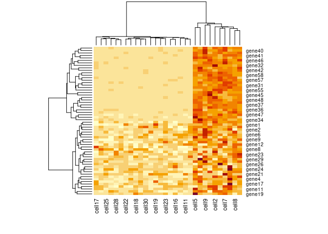

README
================
Yue Pan
19 April, 2022

## Overview

The R package ‘scpoisson’ is developed to visualize the Poissoneity of
scRNA-seq data, and explore cell clustering based on model departure as
a novel data representation.

## Installation

Please install from bitbucket repository “dittmerlab/scpoisson”.

``` r
remotes::install_bitbucket("dittmerlab/scpoisson")
```

``` r
library(scpoisson)
library(magrittr)
library(purrr)
```

    ## 
    ## Attaching package: 'purrr'

    ## The following object is masked from 'package:magrittr':
    ## 
    ##     set_names

## Visualization

The examples below show Q-Q envelope plots comparing sample data with a
theoretical Poisson distribution given the Poisson parameter (mean). The
input can be either a numeric vector or a numeric matrix consists of
integers. If the input is a numeric matrix, the GLM-PCA algorithm will
be applied for parameter estimation. Then some matrix entries (default
200, with estimated Poisson parameters closest to the given Poisson
parameter) will be selected as sample data and compare with the
theoretical distribution. If the theoretical distribution fits the
sample data well, the quantile points (or line) will approximately lie
on the diagonal line, and also within the envelope.

The code here is specific for validation of independent Poisson
distributions, but such idea can be applied to different types of data
under different assumptions of distributions.

``` r
# Numeric vector as input
set.seed(1234)
scppp_obj <- scppp(rpois(200, 3))
qqplot_env_pois(scppp_obj, 3, 100)
```

<!-- -->

``` r
# Count matrix as input
set.seed(1234)
dat <- matrix(c(rpois(300, 5), rpois(200, 1)), ncol = 20)
scppp_obj <- scppp(dat)
qqplot_env_pois(scppp_obj, L = 2, lambda = 5) # small L for a data with less variance
```

<!-- -->

Please refer to vignette for a more detailed guide, including the
application in the real data.

## Clustering

The example below shows Hclust-Depart clustering pipeline based on based
on model departure using a simplified two-cluster simulated data. The
results will be saved in a list. The first element contains the
clustering results for each sample, where the cluster label shows the
top-down cluster in a tree structure. E.g. Both cluster ‘1-1’ and
cluster ‘1-2’ are subclusters from cluster ‘1’ after first split; while
cluster ‘1-1’ and cluster ‘2-1’ come from different cluster after first
split. The second element is a matrix with samples/cells as rows and
cluster index as columns, where each entry contains the hypothesis
testing p-value corresponding to each cluster at each split step (each
cell within the that cluster will have the same p-value).

This simplified example only contains two clusters, with cluster label
either ‘1’ or ‘2’.

``` r
set.seed(1234)
para1 <- matrix(c(rep(2L, 20), rep(1L, 40)), ncol = 1)
para2 <- matrix(c(rep(2L, 10), rep(1L, 20)), nrow = 1)
dat <- para1 %*% para2
dat[31:60, 1:10] <- dat[31:60, 1:10] + 10L
counts <- map_int(dat, ~rpois(1, .x)) %>% 
    matrix(ncol = 30)
colnames(counts) <- paste0("cell", 1:30)
rownames(counts) <- paste0("gene", 1:60)
scppp_obj <- scppp(counts)
heatmap(scppp_obj[["data"]])
```

<!-- -->

``` r
scppp_obj <- HclustDepart(scppp_obj, maxSplit = 3)

# cluster results for each cell after each split
head(scppp_obj[["clust_results"]]$Hclust[[1]])
```

    ##   names cluster
    ## 1 cell1       1
    ## 2 cell2       1
    ## 3 cell3       1
    ## 4 cell4       1
    ## 5 cell5       1
    ## 6 cell6       1

``` r
# p-value for each cell after each split
head(scppp_obj[["clust_results"]]$Hclust[[2]])
```

    ##         [,1] [,2] [,3]
    ## [1,] 0.02274   NA   NA
    ## [2,] 0.02274   NA   NA
    ## [3,] 0.02274   NA   NA
    ## [4,] 0.02274   NA   NA
    ## [5,] 0.02274   NA   NA
    ## [6,] 0.02274   NA   NA

Please refer to vignette for a more detailed guide, including the
application in the real data.

Another option is: keep model departure as data representation but apply
the Louvain algorithm (implemented in Seurat pipeline) for clustering.

``` r
scppp_obj <- LouvainDepart(scppp_obj)
```

    ## Modularity Optimizer version 1.3.0 by Ludo Waltman and Nees Jan van Eck
    ## 
    ## Number of nodes: 30
    ## Number of edges: 435
    ## 
    ## Running Louvain algorithm...
    ## Maximum modularity in 10 random starts: 0.2517
    ## Number of communities: 2
    ## Elapsed time: 0 seconds

``` r
head(scppp_obj[["clust_results"]]$Lclust[[4]])
```

    ##       names cluster
    ## cell1 cell1       1
    ## cell2 cell2       1
    ## cell3 cell3       1
    ## cell4 cell4       1
    ## cell5 cell5       1
    ## cell6 cell6       1

In this simple case, both clustering pipeline give the same clustering
results as we expected.

## Differential Expression

We can find differentially expressed genes between two clusters based on
model departure. Run ‘adj\_CDF\_logit’ function first to calculate the
departure representation. The cluster labels for such comparison need to
match the output from Hclust-Depart clustering. The genes in the output
will be ranked by decreasing order of mean difference between two
clusters.

``` r
scppp_obj <- adj_CDF_logit(scppp_obj) 
scppp_obj <- diff_gene_list(scppp_obj, clust1 = "1", clust2 = "2", t = F)
head(scppp_obj[["de_results"]]$Hclust)
```

    ##   variable clust1_mean clust2_mean clust1_n clust2_n mean_diff statistic
    ## 1   gene42    1.145131   -1.346082       10       20  2.491212       177
    ## 2   gene39    1.107470   -1.314327       10       20  2.421796       183
    ## 3   gene48    1.098889   -1.291513       10       20  2.390401       184
    ## 4   gene53    1.048909   -1.245737       10       20  2.294646       175
    ## 5   gene58    1.044325   -1.250291       10       20  2.294616       166
    ## 6   gene52    1.042028   -1.244017       10       20  2.286046       181
    ##        p.value        padj abs_diff
    ## 1 0.0007587375 0.002845266 2.491212
    ## 2 0.0002830659 0.001887106 2.421796
    ## 3 0.0002369525 0.001777144 2.390401
    ## 4 0.0010403270 0.002851969 2.294646
    ## 5 0.0039363264 0.007618696 2.294616
    ## 6 0.0003972232 0.002018305 2.286046

## Issues and bug reports

Please report any issues at [bitbucket
repository](https://bitbucket.org/dittmerlab/scpoisson/issues).

## References

Townes, F. W., Hicks, S. C., Aryee, M. J., & Irizarry, R. A. (2019).
Feature selection and dimension reduction for single-cell RNA-Seq based
on a multinomial model. Genome biology, 20(1), 1-16.

Stuart T, Butler A, Hoffman P, Hafemeister C, Papalexi E, III WMM, Hao
Y, Stoeckius M, Smibert P, Satija R (2019). “Comprehensive Integration
of Single-Cell Data.” Cell, 177, 1888-1902. doi:
10.1016/j.cell.2019.05.031,
<https://doi.org/10.1016/j.cell.2019.05.031>.
